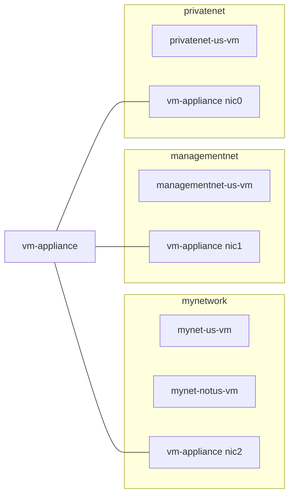
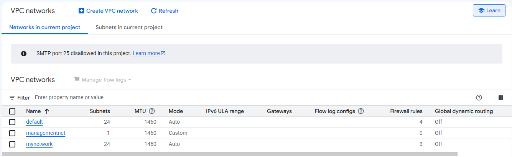
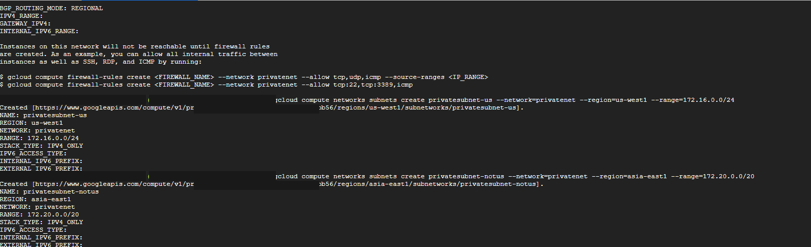
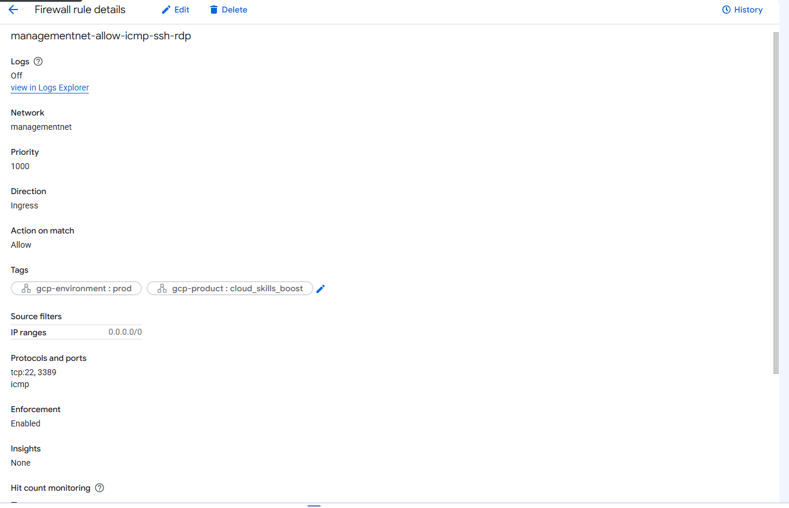
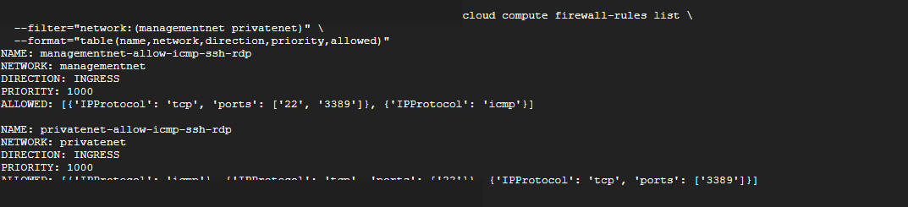
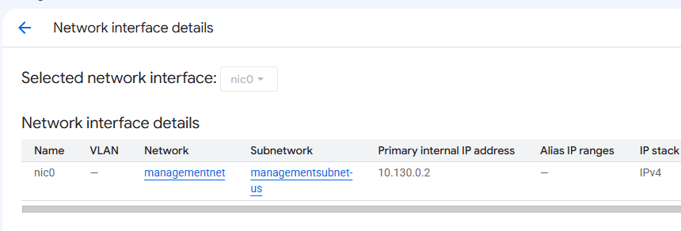
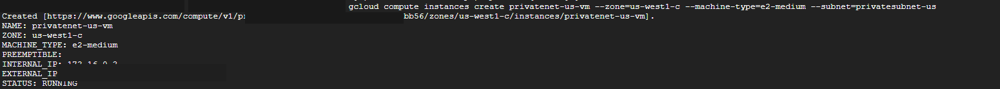
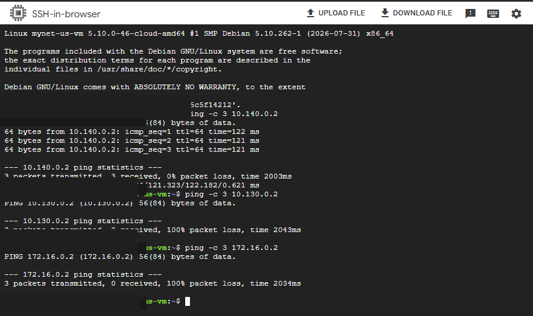
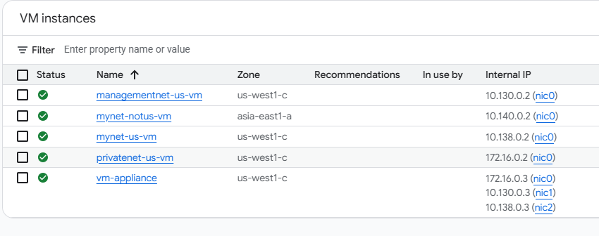

# Google Cloud VPC Network Segmentation Lab

Hands-on Google Cloud networking lab where I built custom VPCs and subnets, configured firewall rules, deployed Compute Engine VMs, tested connectivity between networks, and worked with a multi-NIC VM.

> **Note:** This was a Google Cloud Skills Boost training lab. It was done for hands-on practice and is not a production environment.

## What I Practiced

- Creating custom-mode VPC networks
- Creating regional subnets and choosing CIDR ranges
- Configuring ingress firewall rules
- Using both the Google Cloud Console and `gcloud`
- Deploying VMs into specific subnets
- Testing internal and external connectivity
- Seeing how separate VPCs are isolated by default
- Connecting one VM to multiple VPC networks
- Looking at Linux interfaces and routing

## Lab Architecture



### Custom Network Addressing

| Network | Subnet | Region | CIDR |
|---|---|---|---|
| `managementnet` | `managementsubnet-us` | `us-west1` | `10.130.0.0/20` |
| `privatenet` | `privatesubnet-us` | `us-west1` | `172.16.0.0/24` |
| `privatenet` | `privatesubnet-notus` | `asia-east1` | `172.20.0.0/20` |

---

## 1. Custom VPCs and Subnets

I created `managementnet` as a custom-mode VPC in the Google Cloud Console. Unlike the auto-mode networks already in the lab, it only contained the subnet I created.



I created `privatenet` and two subnets from Cloud Shell:

```bash
gcloud compute networks create privatenet --subnet-mode=custom

gcloud compute networks subnets create privatesubnet-us \
  --network=privatenet \
  --region=us-west1 \
  --range=172.16.0.0/24

gcloud compute networks subnets create privatesubnet-notus \
  --network=privatenet \
  --region=asia-east1 \
  --range=172.20.0.0/20
```



### What I Learned

A VPC is global in Google Cloud, but its subnets are regional. Using custom mode let me decide exactly where the subnets lived and what IP ranges they used.

### Why It Mattered

That kind of control is useful when different systems need to be separated instead of putting everything into one large network.

---

## 2. Firewall Rules

I created ingress rules for `managementnet` and `privatenet` that allowed ICMP, SSH (`tcp:22`), and RDP (`tcp:3389`) as required by the lab.



I also checked both custom VPC firewall rules from the CLI.



### What I Learned

Firewall rules control what traffic is allowed into a VPC based on things like source, protocol, and port.

### Why It Mattered

The lab used `0.0.0.0/0`, which is intentionally wide open. I would not leave SSH or RDP exposed that way in a real environment. I would normally restrict administrative access to approved sources or another controlled access path.

---

## 3. Compute Engine Deployment

I created `managementnet-us-vm` in the Console and verified that its primary interface was attached to `managementnet` / `managementsubnet-us`.

Its internal IP was `10.130.0.2`, which falls inside the subnet's `10.130.0.0/20` range.



I created `privatenet-us-vm` from Cloud Shell:

```bash
gcloud compute instances create privatenet-us-vm \
  --zone=us-west1-c \
  --machine-type=e2-medium \
  --subnet=privatesubnet-us
```



### What I Learned

The subnet a VM is attached to determines where its internal IP comes from and which network it belongs to.

### Why It Mattered

Putting a workload in the right VPC and subnet is part of keeping systems separated and making sure the right firewall and routing rules apply to it.

---

## 4. VPC Connectivity and Isolation

From `mynet-us-vm`, I tested internal connectivity to VMs across the lab.

| Destination | Relationship to Source | Result |
|---|---|---|
| `mynet-notus-vm` | Same VPC, different region | ✅ Successful |
| `managementnet-us-vm` | Different VPC, same zone | ❌ 100% packet loss |
| `privatenet-us-vm` | Different VPC, same zone | ❌ 100% packet loss |



### Key Finding

**VPC membership determined default private connectivity in this lab, not physical zone placement.**

The VM in another region but in the same VPC responded over its internal IP. The VMs in separate VPCs did not, even though they were in the same zone as the source VM.

### Why It Mattered

This showed me that putting systems in separate VPCs creates a real network boundary. If those networks need to communicate, that connectivity has to be added on purpose.

---

## 5. Multi-NIC VM Networking

I created `vm-appliance` with three network interfaces:

| Interface | Network | Internal IP |
|---|---|---|
| `nic0` | `privatenet` | `172.16.0.3` |
| `nic1` | `managementnet` | `10.130.0.3` |
| `nic2` | `mynetwork` | `10.138.0.3` |



Inside the VM, I used:

```bash
sudo ifconfig
```

to verify the interfaces, and:

```bash
ip route
```

to check the routing table.

The VM could reach systems on directly connected subnets. It could not reach the remote `mynet-notus-vm` subnet because there was no matching specific route for that destination, so the traffic followed the default route instead.

### What I Learned

Adding multiple NICs does not automatically give a VM a working route to every subnet in every connected VPC. The Linux routing table still decides where traffic goes.

### Why It Mattered

For a firewall, proxy, or other multi-homed system, the interfaces are only part of the setup. Routing still has to be planned correctly or traffic can take the wrong path or fail completely.

> **Evidence note:** The timed lab ended before I saved terminal screenshots of `ifconfig`, the Task 4 ping tests, and `ip route`. I did preserve the screenshot showing the three NICs on `vm-appliance`.

---

## Key Takeaways

- VPCs are global in Google Cloud, while subnets are regional.
- Custom mode gave me control over subnet location and CIDR ranges.
- Firewall rules determine which traffic is allowed into a network.
- Separate VPCs were isolated from each other by default in this lab.
- A VM's network interface determines its VPC, subnet, and internal IP.
- A multi-NIC VM can connect to several VPCs at once.
- Multiple NICs do not replace proper routing.
- The Linux routing table still decides which path traffic takes.

## Tools and Technologies

`Google Cloud` · `VPC` · `Compute Engine` · `Cloud Shell` · `gcloud CLI` · `Linux` · `ICMP` · `SSH` · `RDP` · `CIDR` · `Routing`

## Detailed Notes

My full task-by-task notes are in [`docs/lab-notes.md`](docs/lab-notes.md).

## Disclaimer

This repository documents a Google Cloud Skills Boost training lab completed for learning and professional development. The resources were temporary and do not represent a production deployment. No employer, customer, or production data is included.
